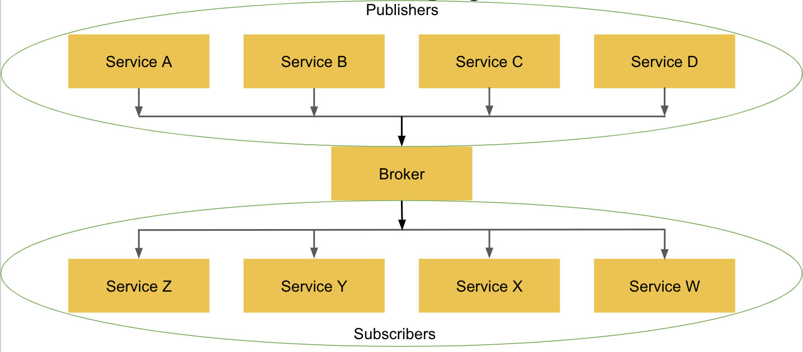

Kafka:

- Stream History
- Scalable Consumption
- Immutable Data
- Highly Available
- Scalable
- Many Consumers
- Many Producers

Open source, distributed message streaming platform.
A set of components (deployables/libraries/APIs)

### Publisher/Subscriber pattern

Core Kafka APIs:

- Producer API: publish a record to a topic.
- Consumer API: subscribe to one or more topics and process their records
- Streams API: helps to consume, transform and produce streams of record (lemonades)
- Connector API: allows to build consumers and producers that bring data from existing sources (DB, S3, MQ, etc) 
into Kafka and delivers data from kafka topics into other systems
- REST API: admin tasks and integration with sources with no support yet

Broker
- A single Kafka server. The broker receives messages from producers, assigns offsets to them and commits the messages in disk. It also responds to fetch requests for partitions from consumers and send messages back.   

Kafka cluster
- 1 o more kafka brokers. One broker must be the cluster controller

Apache Zookeeper
- Monitors and save metadata about kafka cluster, helps broker controller to manage brokers.

Key
- Message Id that helps to decide to which topic partition that message is published.
- Kafka doesn't care at all about key/record/message type/schema. You can send it pure bytes if you wanted (AVRO, ProtoBuff). Although is recommended some sort of structure. Json, XML. 

What's a record/message?
- A message is the unit of data within Kafka. 
- Each record consists of a key, a value, and a timestamp.
- For efficiency, messages are written into kafka in batches (collection of messages)

What's a topic?
- A topic is a category or feed name to which records/messages are published
- Topics are additionally broken down into a number of partitions

Partitions:

- Each partition is an ordered, immutable sequence of records that is continually appended to
- The records in the partitions are each assigned a sequential id number called the offset that uniquely identifies each record within the partition.
- Allow to distribute the data load/requests/storage across multiple brokers/servers
- Act as the unit of parallelism
- Each partition has one server which acts as the "leader" and zero or more servers which act as "followers". The leader handles all read and write requests for the partition while the followers passively replicate the leader. If the leader fails, one of the followers will automatically become the new leader. Each server acts as a leader for some of its partitions and a follower for others so load is well balanced within the cluster.

Offset:
-  sequential id number that uniquely identifies each record within the partition.

What's the zookeeper? Why does kafka needs it?

- Kafka is run as a cluster on one or more servers that can span multiple datacenters.
- The Kafka cluster stores streams of records in categories called topics.

What's the retention period?
- Durable storage of messages for some period of time or capacity.
- Configurable per topic either in time or disk size.
- Topics can be set as log compacted. Keeping only the last message produced with a specific key.

Publish and subscribe to streams of events
Store events in a durable way
Process streams of events as they occur

Replication:
- Makes sure that you have a specific number of replicas for a record among the brokers
- Fault Tolerance
- Only available in the same kafka cluster, not for multiple clusters.

Consumer Group:
- each record published to a topic is delivered to one consumer instance within each subscribing consumer group
- If all the consumer instances have the same consumer group, then the records will effectively be load balanced over the consumer instances.
- If all the consumer instances have different consumer groups, then each record will be broadcast to all the consumer processes.
Rebalancing:
- If new instances join the group they will take over some partitions from other members of the group; if an instance dies, its partitions will be distributed to the remaining instances.
Consumer Instance
- each instance is the exclusive consumer of a "fair share" of partitions at any point in time.
- each instance is assigned one or more partitions. A partition is not assigned to more than one instance

Producer:
- Publish records to one or more topics
- Responsible for choosing which record to assign to which partition within the topic
- If key is null then the partition is assigned in a round-robin fashion
- By default it picks a partition based on the key
What happens if you add one more partition to an already created topic?
- You should never do this because the message order is lost

Offset Commits

Comandos Utiles del CLI?
- Consumer
- Producir
- Crear topicos
- Describir consumer groups?

Docker compose to deploy Kafka cluster locally

#Configurations

###[Producer Configs](https://kafka.apache.org/documentation/#producerconfigs)
###[Consumer Configs](https://kafka.apache.org/documentation/#consumerconfigs)

#Commands

###Topics

- `kafka-topics --bootstrap-server <broker-addresses> --list`
- `kafka-topics --bootstrap-server <broker-addresses> --describe --topic <topic-name>`
- `kafka-topics --bootstrap-server <broker-addresses> --create --topic <topic-name> --replication-factor <number-of-replicas> --partitions <number-of-partitions>`

###Consumer Groups

- `kafka-consumer-groups --bootstrap-server <broker-addresses> --list`
- `kafka-consumer-groups --bootstrap-server <broker-addresses> --describe --group <group-id>`
- `kafka-consumer-groups --bootstrap-server <broker-addresses> --describe --group <group-id> --members`
- `kafka-consumer-groups --bootstrap-server <broker-addresses> --reset-offsets --group <group-id> --topic <topic-name> --to-earliest --execute`

Bibliography 
- Kafka: The definitive guide
